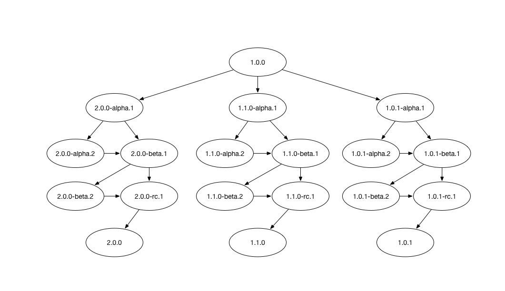

[](https://travis-ci.org/trifia/LXSemVer)
[](https://cocoapods.org/pods/LXSemVer)
[](https://github.com/Carthage/Carthage)
[](https://github.com/trifia/LXSemVer)

# LXSemVer

`LXSemVer` aims to provide a simple yet specification compliant implementation of [Semantic Versioning 2.0.0](http://semver.org/) (SemVer) in Swift 4.x.

## Features

- [x] Parsing version string into `Version` instances.
- [x] `DotSeparatedValues` (DSV) class to represent prerelease and/or build metadata.
- [x] `DotSeparatedValues` and `Version` instances support `next()`, which provides a list of logical next DSVs and/or versions.
- [x] `DotSeparatedValues` and `Version` instances follows SemVer's precedence rule.

## Requirements

- Mac OS X 10.10+ / iOS 8.0+
- Xcode 9.0+

## Installation

### CocoaPods

```ruby
pod "LXSemVer", "~> 3.0"
```

### Carthage

```
github "lxcid/LXSemVer" ~> 3.0
```

## Usage

### Parsing a Version String

```swift
import LXSemVer

if let version = Version(string: "1.0.0") {
	print(version)
}
```

### From String Literal and Getting Next Verions

```swift
import LXSemVer

let version: Version = "1.0.1-alpha.1"
print(version.next())
```

## Compatibility

`LXSemVer` 3.0 uses Swift 4.

For projects using Swift 3, please use `LXSemVer` 2.0.

For projects using Swift 2.2 or older, please use `LXSemVer` 1.2.

## Concept

### Version Graph

`LXSemVer` unique point is its concept of version graph. SemVer precedence rule (SemVer Specification 11) allow for logical digraph of versioning.



At any specific version, there are multiple logical paths leading to the next versions and these versions have logical ordering between them as well.

`LXSemVer` extends on SemVer by recognizing `alpha`, `beta` and `rc` as the first prerelease identifiers.

Together, they make `LXSemVer` an excellent choice for versioning management.

## License

`LXSemVer` is released under the MIT license. See [LICENSE](LICENSE) for details.
